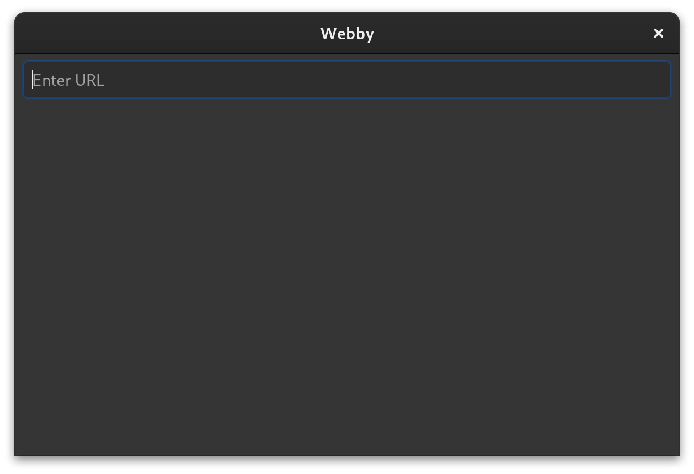

# GTK Webby

Webby is a proof-of-concept application that behaves like a browser, but one that renders native GTK
applications rather than websites.

## Running

To run, first make sure you have the following installed:

1. Rust + Cargo
2. GTK4 development libraries
3. Lua 5.4 development libraries

An easy way to do this is to use `nix-shell`, or you can use your package manager.

Once these are installed, running is simply

```sh
$ cargo run
```



### Examples

Running Webby will launch a window that can be used to load GTK "web" applications. A number of
examples are included with Webby that only require Rust:

```sh
$ cd examples/hello
$ cargo run
```

Once the example is running, you can load it in Webby by using the URL `http://localhost:8000`.

## Tips

When running the app, use `Ctrl-Shift-D` to open up the GTK inspector.

# Lua Scripting Reference

## Global Functions

| Name | Description |
| --- | --- |
| `find_widget(id: String) -> Widget` | Find a widget by its Builder ID and return a reference to it |
| `fetch(url: String, response: function(err, response))` | Fetch a URL asynchronously. The provided callback will be invoked with either `err` or `response` populated. |
| `alert(message: String)` | Open an alert dialog with a message |
| `submit_form(method: String, action: String, values: Table)` | Submit a form |

## Widget Methods

| Name | Description |
| --- | --- |
| `connect(signal: String, after: Boolean, callback: function())` | Connect a signal handler. Before invoking the callback, the global value `this` will be set to the widget |
| `get_property(property_name: String)` | Get a property value; only works for primitive return types (like strings or booleans) |
| `set_property(property_name: String, property_value: Any)` | Set a property value; only works for primitive types (like strings or booleans) |
| `get_text()` | Get the text from an Entry's buffer |
| `add_css_class(class: String)` | Add a CSS class |
| `remove_css_class(class: String)` | Remove a CSS class |
| `set_css_classes(classes: Array<String>)` | Set a list of CSS classes |
 

<!-- vim: set tw=100: -->
